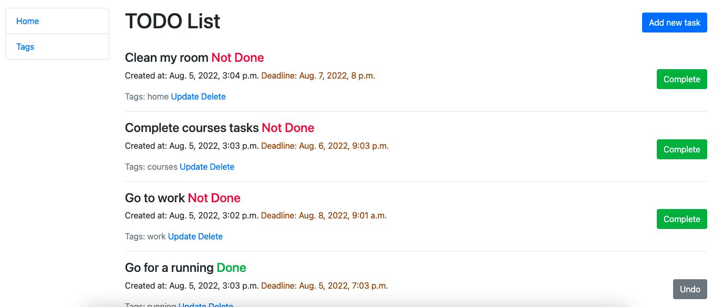

# TODO List

Django project for managing your days

## Check it out!

[TODO List project on Heroku](https://todo-list-note-app.herokuapp.com/)

## Installation

Python must be already installed

```shell
git clone https://github.com/anatomst/todo-list.git
python3 -m venv venv
source venv/bin/activate (on Linux and macOS) or venv\Scripts\activate (on Windows)
pip install -r requirements.txt
python3 manage.py makemigrations
python3 manage.py migrate
python manage.py runserver
```

## Features

* Add tasks and tags
* Update status of your tasks
* Fixing your deadlines


## Demo



